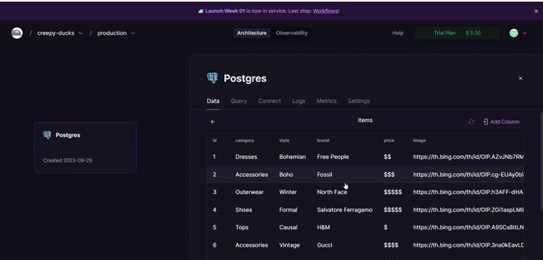

# WEB103 Project 1 - StyleSpark

Submitted by: **Sabrina Zheng**

About this web app: **A web platform that allows users to browse, and filter for trending fashion products that users shared. It includes a while range of products from different categories to different brands. Purpose is to let users to share and discover trending fashion items. This web app is to not only keeps users updated on the latest trend but also offer a sense of community around fashion.**

Time spent: **3** hours

## Required Features

The following **required** functionality is completed:

<!-- Make sure to check off completed functionality below -->
- [x] **The web app uses only HTML, CSS, and JavaScript without a frontend framework**
- [x] **The web app is connected to a PostgreSQL database, with an appropriately structured database table for the list items**
- [x] **The PostgreSQL database includes a table that matches the data displayed in the web app**
  - [x] **NOTE: Your GIF or a screenshot added to the README must include a view of your Railway database that shows the contents of the table used by your app**

The following **optional** features are implemented:

- [ ] The user can search for items with a specific attribute

The following **additional** features are implemented:

- [ ] List anything else that you added to improve the site's functionality!

## Video Walkthrough

**Note: please be sure to 

Here's a walkthrough of implemented required features:

<!-- Replace this with whatever GIF tool you used! -->
GIF created with ...  Add GIF tool here
<!-- Recommended tools:
[Kap](https://getkap.co/) for macOS
[ScreenToGif](https://www.screentogif.com/) for Windows
[peek](https://github.com/phw/peek) for Linux. -->

## Notes

Describe any challenges encountered while building the app or any additional context you'd like to add.

## License

Copyright 2023 Sabrina Zheng

Licensed under the Apache License, Version 2.0 (the "License"); you may not use this file except in compliance with the License. You may obtain a copy of the License at

> http://www.apache.org/licenses/LICENSE-2.0

Unless required by applicable law or agreed to in writing, software distributed under the License is distributed on an "AS IS" BASIS, WITHOUT WARRANTIES OR CONDITIONS OF ANY KIND, either express or implied. See the License for the specific language governing permissions and limitations under the License.
